# 🎁 포장의 민족

  

 
 

# 📣 프로젝트 목적
> **요기요와 배달의 민족의 주문 서비스를 클론 코딩하여 Spring Boot(백엔드)와 Vue.js(프론트엔드) 학습하기 위함**
 

# 💡 서비스 소개
> **포장의 민족은 신속한 포장 주문 서비스를 제공합니다. 회원들은 웹서비스를 통해 등록한 주소를 기반으로 주변 가게들을 조회할 수 있고, 가까운 가게에서 포장된 음식을 빠르게 받을 수 있습니다.**
 

# 🗓 프로젝트 기간
> **2024/02/19 ~ 2024/02/23**
 

# 📱팀 명: SNS
| 팀 원 | 이름 |
|:---:|:---:|
| 팀장 | [한종승👨‍💻](https://github.com/BellWin98) |
| 팀원 | [배소영👩‍💻](https://github.com/qoth-0) |
| 팀원 | [심재혁👨‍💻](https://github.com/SimJH99) |
| 팀원 | [이원태👨‍💻](https://github.com/wontae0924) |
 

# 💪 기술 스택
## 🛠 개발환경 
>  
>  
>  
>  
>  
>  
>  

 

## 🔊 협업 툴
>  
>  
>  
>  
>  
>  
 

# 📝 기능 테스트(GIF)

<h2>😀 회원(Member)</h2>

  <h4>회원가입(이메일 인증 & 카카오 주소 API 연동)</h4>
  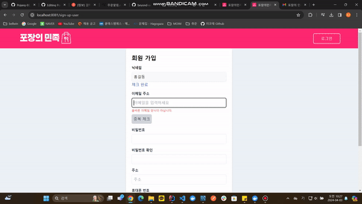

  <h4>로그인</h4>
  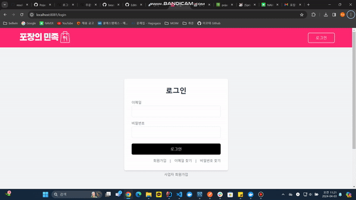

  

<h2>🧾 장바구니 & 주문</h2>

  <h4>주문등록 & 주문 접수 알림</h4>
  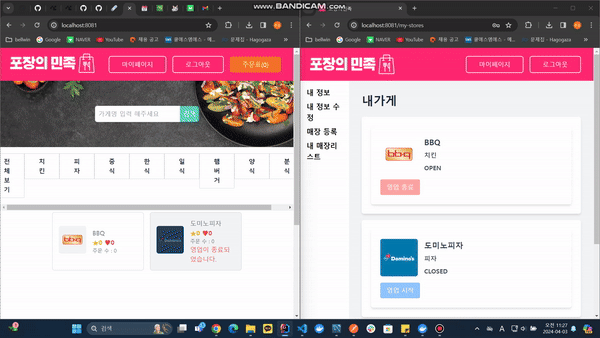

<h2>🏪 가게 & 찜 & 리뷰</h2>

  <h4>검색 및 찜</h4>
  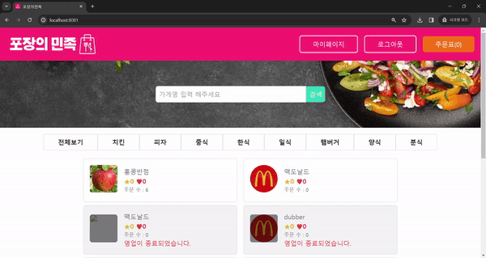

  <h4>매장 등록</h4>
  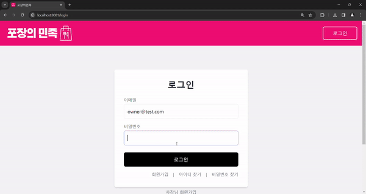

  <h4>주문상태 변경 및 리뷰등록</h4>
  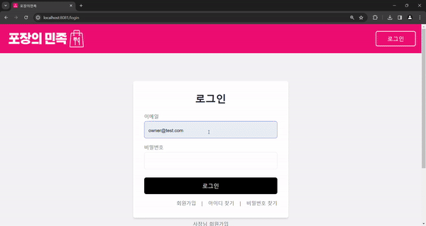

  <h4>리뷰조회</h4>
  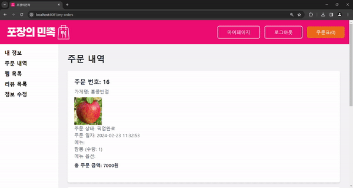

 

# 📈 ERD 모델링
[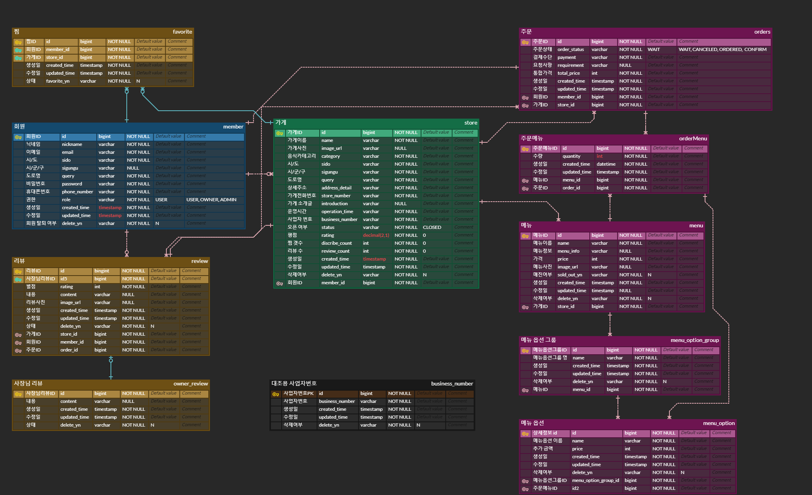](https://www.erdcloud.com/d/xroTBFytvBCr9fm5S)
 
`사진 클릭시 이동`

 

# 📝 API명세서
[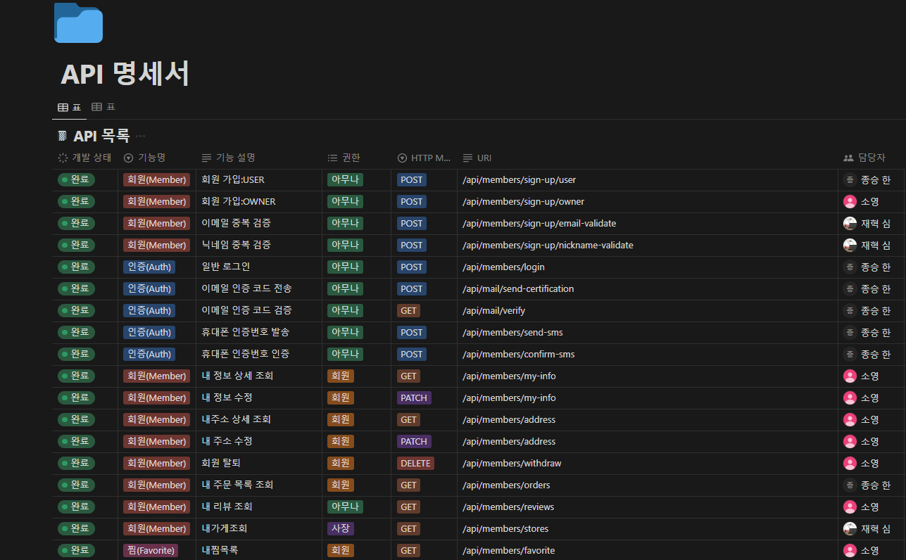](https://robust-skunk-0f9.notion.site/API-0f59651871d44b36a32874c9f8b4f0e0?pvs=4)
 
`사진 클릭시 이동`

 

# 📈 Architecture

## 📍Back-End
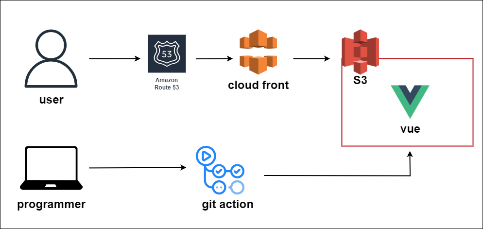

## 📍Front-End
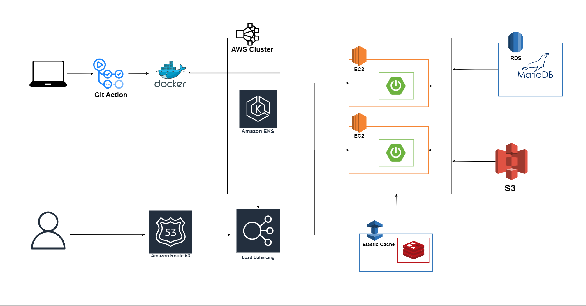

 

# 🚩 Git 브랜치 전략

  

 

- 저장소를 효과적으로 활용하기 위해 SNS팀은 Github-Flow 전략 브랜치를 생성한다.
1. 이슈 탭 클릭 → New Issue → 템플릿 선택 → 이슈 제목 및 작업할 내용 입력 → Assignees 본인으로 설정 → Label 선택 → issue 생성
2. 브랜치 생성: main 브랜치 → feature 브랜치 분기
3. 브랜치 규칙: feature/{엔티티}-(이슈번호)
4. 커밋 순서: [Type] 작업 내용(#이슈번호)
5. PR 날린 후 팀원들의 코드 리뷰
6. 코드 리뷰 완료되면 main 브랜치에 Merge 
 

# 📌 요구사항 명세서

<h2>😀 회원(Member)</h2>

1. 일반 회원은 내 정보를 조회할 수 있다.
2. 일반 회원은 주문 내역을 조회할 수 있다.
3. 일반 회원은 가게를 찜 및 찜 취소를 할 수 있다.
4. 일반 회원은 가게에 리뷰를 남길 수 있다. (주문 확정된 경우)
5. 일반 회원은 가게 찜 목록을 조회할 수 있다.
6. 일반 회원은 가게 리뷰 목록을 조회할 수 있다.
7. 일반 회원은 개인 정보를 수정할 수 있다.
8. 일반 회원은 회원을 탈퇴할 수 있다.

<h2>🏪 가게(Store)</h2>

1. 홈 화면에서 가게명을 검색할 수 있다.
2. 등록된 가게를 전체 조회할 수 있다.
3. 등록된 가게를 카테고리 별로 조회할 수 있다.
4. 사장은 신규 가게를 여러개 등록할 수 있다.
5. 사장은 등록한 가게 리스트를 조회할 수 있다.
6. 사장은 등록한 가게의 상세 정보를 조회할 수 있다.
7. 사장은 등록한 가게에 달린 리뷰를 조회할 수 있다.
8. 사장은 매출 정보를 일, 주, 월별로 확인할 수 있다.
9. 사장은 등록한 가게의 정보를 수정할 수 있다.
10. 사장은 등록한 가게를 삭제할 수 있다.
11. 가게의 평점을 확인할 수 있다.
12. 가게의 찜 수를 확인할 수 있다.

<h2>📋 메뉴(Menu)</h2>

1. 사장은 메뉴를 등록할 수 있다.
2. 사장은 메뉴에 속한 메뉴 옵션 그룹을 등록할 수 있다.
3. 사장은 메뉴 옵션 그룹에 속한 메뉴 옵션을 등록할 수 있다.
4. 사장은 메뉴, 메뉴 옵션 그룹, 메뉴 옵션을 수정 및 삭제할 수 있다.
5. 회원은 가게의 메뉴 목록을 조회할 수 있다.
6. 회원은 메뉴의 상세 정보를 조회할 수 있다.

<h2>🧾 주문(Order)</h2>

1. 회원은 장바구니에 담긴 메뉴를 주문할 수 있다.
2. 회원은 주문 단계에서 결제수단을 선택할 수 있다.
3. 회원은 주문 단계에서 요청사항을 입력할 수 있다.
4. 회원은 총 주문 금액과 주문 내역을 확인할 수 있다.
5. 회원은 주문을 취소할 수 있다.
6. 주문이 완료되면 장바구니가 초기화된다.
7. 회원은 주문 내역을 조회할 수 있다.
8. 사장은 등록한 가게의 주문 내역을 조회할 수 있다.
9. 회원과 사장은 접수 대기 상태일 때 주문을 취소할 수 있다.
10. 사장은 회원의 주문을 접수할 수 있다.
11. 회원이 포장을 완료하면 사장은 주문을 확정할 수 있다.
12. 주문 상태는 접수 대기, 주문 취소, 주문 접수, 주문 확정으로 구분된다.

<h2>🛒 장바구니(Cart)</h2>

1. 회원은 장바구니에 메뉴를 담을 수 있다.
2. 회원은 장바구니를 비울 수 있다.
3. 장바구니에 이미 담긴 메뉴와 동일한 메뉴를 선택한 수량만큼 갯수가 증가한다.
4. 회원은 장바구니에 담긴 메뉴를 주문할 수 있다.
5. 회원은 장바구니에 담긴 메뉴, 수량, 단가, 예상 결제 금액을 조회할 수 있다.

<h2>🔑 인증(Authentication)</h2>

1. 일반 회원가입을 할 수 있다.
2. 사장 회원가입을 할 수 있다.
3. 회원 가입 시 이메일 인증을 할 수 있다.
4. 회원 가입 시 SMS 인증을 할 수 있다.
5. 로그인 / 로그아웃을 할 수 있다.
6. 가입된 회원만 서비스를 이용할 수 있다.

 

# 📝 중점 기술 명세

<h2>로그인</h2>

  
  | 기술 영역 | 설명 |
  | --- | --- |
  | Front | 1. 이메일과 비밀번호를 공백으로 서버에 전송하면 에러가 나도록 분기처리 2. 이메일 input 타입을 이메일로 해서 이메일 양식이 맞지않으면 에러 알림 처리 3. 토큰을 서버에서 받았을 때, 해당 토큰을 JWTDECODE함수를 사용해 복호화해서 토큰안에 내용들을 조회한다, 4. 토큰, 사용자권한, 이메일을 로컬스토리지에 저장한다. 5. 로그인이 성공했을 떄, USER는 홈화면, OWNER는 마이페이지로 이동한다. |
  | Backend | 1. 프론트에서 이메일과 비밀번호를 입력을 하면 백엔드에서 일치여부를 검증한다. 2. 비밀번호가 프론트에서 받은 비밀번호랑 DB에번호와 암호화해서 비교하여 일치하면 일치여부가 검증된다. 3. 검증이 완료 되면 백엔드에서 토큰을 생성한다. 4. Access토큰을 JWT형식으로 발행하고 해당 토큰이 프론트로 전달된다. 5. 토큰안에 정보는 만료시간, 이메일, 사용자권한이 들어가있다.  |

<h2>회원가입</h2>

| 기술 영역 | 설명 |
| --- | --- |
| Front | 1. 로그인 화면에서 회원가입 버튼이 존재해 해당 버튼을 클릭하면 회원가입 페이지로 이동한다. 2. 사장님 회원가입 버튼도 따로 만들어 회원가입 시 서버에 데이터 전송할 때, 회원의 권한을 자동으로 설정하게 한다. 3. 각 입력 란에 공백으로 서버에 전송할 경우 예외 분기 처리 설정 4. 이메일과 닉네임을 중복검사하여 DB에 조회하여 다른 계정과 중복되지 않도록 검증한다. 5. 이메일, 비밀번호, 휴대전화를 정규식으로 제한하여 입력 값의 규칙을 적용한다. 6. 정규식에 맞지않게 입력할 경우 예외처리 적용. 7. 형식에 맞게 데이터를 입력하면 서버에 전송한다. 8. 회원가입 완료 시, 로그인 화면으로 이동한다.  |
| Backend | 1. 프론트에서 받은 데이터 값 중에서 null로 들어오는 값이 있으면 에러를 프론트에 전송한다.  2. 이메일과 휴대폰번호, 닉네임은 unique 설정이 되어있어 DB에 조회해서 같은 값이 있으면 프론트에 에러를 전송한다. 3. 값이 형식이 완료 되었으면 DB에 회원 정보를 저장하고 프론트에 성공메시지 전송  |

<h2>내 정보/매장 조회</h2>

| 기술 영역 | 설명 |
| --- | --- |
| Front | 1. 서버에 내 정보 조회에 대한 요청을 서버에 전송한다. 2. 서버에 요청 전송할 때, 로컬스토리지에 저장되어있는 토큰을 헤더형식에 맞춰 같이 전송한다. 3. 조회요청이 성공되어 서버에서 데이터를 받았을때, 각 데이터에 맞는 위치에 v-model를 사용하여 양방향데이터로 조회가 성공되면 바로 값이 입력되도록 한다.  |
| Backend | 1. 프론트 토큰 값에서 받은 authenticatinon에 담긴 SecurityContextHolder에서 사용자 정보 추출 2. 프론트에서 받은 데이터 값 중에서 null로 들어오는 값이 있으면 에러코드를 프론트에 전송한다. 3. 사업자 번호가 DB에 저장 된 사업자 번호 대조 테이블에 존재하지 않으면 에러코드를 전송한다. 4. 매장등록이 완료되었을 때, 값들을 DB에 저장하고 성공메시지를 프론트에 저장한다.  |

<h2>내 정보 수정</h2>

| 기술 영역 | 설명 |
| --- | --- |
| Front | 1. 서버에 정보 수정에 대한 요청을 서버에 전송한다.  |
| Backend | 1. 프론트에서 받은 데이터 값 중에서 null로 들어오는 값이 있으면 에러코드를 프론트에 전송한다 2. 사업자 번호가 DB에 저장 된 사업자 번호 대조 테이블에 존재하지 않으면 에러코드를 전송한다. 3. 매장등록이 완료되었을 때, 값들을 DB에 저장하고 성공메시지를 프론트에 저장한다.  |

<h2>매장 등록</h2>

| 기술 영역 | 설명 |
| --- | --- |
| Front | 1. 회원가입과 유사한 구조를 갖고있지만 매장등록에서는 이미지 파일을 같이 등록한다. 2. 매장 등록 시 multipartformdata 형식으로 서버에 입력한 값을 전송한다. 3. 각 입력란의 공백으로 서버에 전송하면 예외처리를 수행한다.  |
| Backend | 1. 프론트에서 받은 데이터 값 중에서 null로 들어오는 값이 있으면 에러코드를 프론트에 전송한다. 2. 사업자 번호가 DB에 저장 된 사업자 번호 대조 테이블에 존재하지 않으면 에러코드를 전송한다. 3. 이미지 파일을 multipartfile형식으로 받아서 해당 파일을  바이트로 변환하고 서버에서 설정한 경로에 저장하면서 같은 이미지파일이 있다면 덮어쓰기를 하고 없으면 생성하도록 한다.  4. 바이트로 변환이 안되면 에러를 전송한다.  5. 매장등록이 완료되었을 때, 값들을 DB에 저장하고 성공메시지를 프론트에 저장한다.  |

<h2>장바구니 & 주문</h2>

| 기술 영역 | 설명 |
| --- | --- |
| Front | 1. 메뉴 선택 후 옵션을 체크하거나, 메뉴 수량을 증감하면 총 주문 금액이 업데이트 된다.   ㅇ @change 기능을 사용하여 이벤트 발생 시 총 주문 금액을 증감하는 함수 실행 (이벤트 핸들링)   2. 메뉴와 옵션 선택 후 장바구니에 담으면 로컬 스토리지에 장바구니 정보가 담긴다.   ㅇ vuex 라이브러리를 사용하여 장바구니 정보 전역 상태 관리   ㅇ 메뉴 리스트에서 장바구니에 담을 객체를 생성한 후, data()에 정의된 데이터로 적절히 조립  3. 장바구니에 메뉴를 추가하면 헤더 주문표에 담긴 메뉴의 개수가 업데이트 된다.   ㅇ mapGetters를 사용하여 store에 저장된 장바구니 정보를 기반으로 상태 계산  4. 장바구니 초기화 기능: store.js에 정의된 함수를 통해 장바구니 관련 데이터만 로컬 스토리지에서 초기화 5. 주문 상세 페이지에서 로컬 스토리지에 담긴 장바구니 데이터를 추출하여 서버로 전송할 데이터 형태에 맞게 조립   ㅇ 서버 단의 RequestDto 형태에 맞게 객체를 조립한다.   ㅇ axios post 요청으로 서버에 조립된 객체를 전송한다.  |
| Backend | 1. 프론트에서 받은 주문 데이터의 총 주문 금액을 검증한다.  ㅇ 중간에 연산이 조작될 수 있으므로 검증 수행 ㅇ 주문 메뉴 수량과 옵션 가격이 일치하는 지 검증  2. 선택된 메뉴 정보 리스트 안에 메뉴 id, 메뉴 수량, 메뉴에 추가된 옵션 리스트가 담겨있다.  ㅇ 2중 for문을 통해 데이터를 추출하여 order, orderMenu, menuOption Entity에 저장한다. ㅇ 각 Entity 별 양방향 연관관계 설정  3. 사용자 주문 내역을 최신 순으로 정렬(2가지 방법) ㅇ JPA를 사용하여 OrderRepository findBy 메서드를 커스터마이징 ㅇ 컨트롤러 메서드에 PageableDefault 어노테이션 활용  4. 일반 회원 또는 사장 회원이 주문 API 요청 시 검증 ㅇ 사장이 회원의 주문을 접수, 취소, 확정할 때, 해당 가게를 실제로 등록한 사장인 지 검증 ㅇ일반 회원이 메뉴를 주문할 때, 주문한 메뉴가 가게에 등록된 메뉴인지 검증   5. 장바구니에 두 가게의 메뉴가 들어갈 수 없다.   |

<h2>매장 목록 조회 & 검색 기능</h2>

| 기술 영역 | 설명 |
| --- | --- |
| Front | 1. 데이터를 받고 화면이 나오기 위해 Mounted 상태에서 서버에 목록 조회에 대한 요청을 서버에 전송후  응답이 오면 매장을 조회한다. 2. 상위 컴포넌트에 있는 음식 카테고리 버튼이나 검색으로 해당 데이터를 props 받게되면 watchEffect가 감지 후 기존에 남아있던 데이터 초기화하고  매장을 조회한다.  3. 목록을 추가 데이터 조회를 위해 페이지 이동 방식을 스크롤로 변경 한다.  ㅇ스크롤 방식을 이용 할 때 페이지 화면 창이 특정 하단 도달 했을 때 추가 데이터를 조회한다.  ㅇ만약 데이터를 아직 조회 중 이거나 추가 데이터가 더 이상 없을 때는 추가 데이터 조회를 멈춘다.  |
| Backend | 1. 프론트에서 받은 데이터 값을 받아 목록을 전체 조회한다. 2. specification를 이용하여 해당 데이터에 체크(이름or음식카테고리)한 종류들을 비교하여 목록을 조회 한다.  3. 목록을 조회 할 때 가게 OPEN/CLOSE 상태에 따라 OPEN한 매장부터 조회한다. |

<h2>매장 상세조회</h2>

| 기술 영역 | 설명 |
| --- | --- |
| Front | 1. 매장 목록 조회에서 데이터를 받아 해당 매장 조회에 대한 요청을 서버에 전송한 후 응답이 오면 해당 매장을 상세조회 한다. |
| Backend | 1. 프론트에서 받은 데이터 값 중에서 null로 들어오는 값이 있으면 에러를 프론트에 전송한다. |

<h2>찜</h2>

| 기술 영역 | 설명 |
| --- | --- |
| Front | 1. 매장 조회 시 해당 매장의 찜 수를 표시한다. 2. 사용자의 찜 여부에 따라 하트 색이 바뀐다. ㅇ 찜 활성화  : 빨간색, 찜 비활성화 : 회색 3. 로그인 없이 찜 등록 시 로그인 화면으로 이동한다.  |
| Backend | Favorite 테이블에 Store_id, Member_id, FavoriteY/N(찜 여부)을 관리한다.  찜 하기 1. SecurityContextHolder에 담긴 유저정보로 해당 매장을 찜한다.  2. 찜 여부는 Favorite Y/N로 관리하기 때문에 이미 존재하는 찜(회원-매장-Y)이면  중복 에러를 전송한다. 3. 튜플은 존재하나 Favorite N인 경우 Y로 변경한다.  찜 취소 1. SecurityContextHolder에 담긴 유저정보와 해당 매장의 찜 여부를 확인하여 취소한다.  2. 취소 시 Favorite Y를 N으로 변경한다.  매장별 찜 수 조회 1. FavoriteRepository에서 해당 매장과 FavoriteY인 찜 리스트를 조회한다. 2. 그 중 회원탈퇴 후 30일이 지나지 않은 회원의 찜을 제외하고 개수를 센다.  내 찜 목록 조회 1. SecurityContextHolder에 담긴 유저와 FavoriteY인 찜 리스트를 조회한다.  |

<h2>리뷰</h2>

| 기술 영역 | 설명 |
| --- | --- |
| Front | 1. 리뷰 작성 버튼은 주문확정 상태일 경우만 표시한다.  2. 리뷰 작성 시 별점을 등록한다. 3. 매장 조회 시 해당 매장의 평점을 표시한다. 4. 등록된 리뷰가 없을 경우 NaN값을 ‘등록된 리뷰가 없습니다.’로 표시한다.  |
| Backend | Review 테이블에 Store_id, Member_id, order_id,  DeleteY/N(삭제여부), contents, rating(별점), img_url을 관리한다.  리뷰 작성 1. 리뷰 작성은 주문 건당 하나만 가능하다.  ㅇ order_id로 관리 2. 삭제여부를 DeleteY/N으로 관리하기 때문에 DeleteN인 경우 중복 에러를 전송한다. 3. 튜플은 존재하나 DeleteY인 경우 N으로 바꾸고 내용을 변경시킨다. 4. 해당 주문을 등록한 회원 본인만 리뷰 작성이 가능하다.  ㅇ SecurityContextHolder에 담긴 유저정보와 orderId로 조회한 order의 member와 비교하여 다르면 에러를 전송한다. 5. 주문상태가 CONFIRM인 경우만 작성 가능하다.  리뷰 수정 1. 해당 주문을 등록한 회원 본인만 리뷰 수정이 가능하다.  ㅇ SecurityContextHolder에 담긴 유저정보와 orderId로 조회한 order의 member와 비교하여 다르면 에러를 전송한다. 2. ReviewRepository에서 해당 order와 DeleteN인 리뷰를 조회하여 수정한다.  평점 조회 1. 해당 매장의 DeleteN인 리뷰들만 조회한다. 2. 조회된 리뷰의 평점들의 총합을  리뷰 수로 나누어 평점을 구한다. 3. DecimalFormat으로 소숫점 한 자리까지만 표시한다.  |

<h2>회원 탈퇴</h2>

| 기술 영역 | 설명 |
| --- | --- |
| Backend | 1. 탈퇴 시 부정 이용 방지 등을 위하여 탈퇴일로부터 30일 이내에 재가입이 불가능하도록 한다. ㅇ 30일 동안 회원정보를 보관하기 위해 회원 탈퇴 시 member테이블에 DeleteY로 변경한다. ㅇ스케쥴러로 30일이 지나면 DeleteY인 회원의 튜플을 삭제한다. ㅇ 30일의 기준은 DeleteY로 변경 후 반영된 updated_time을 기준으로 한다. ㅇ회원 삭제 시 연관된 테이블의 튜플을 모두 제거한다.  |

